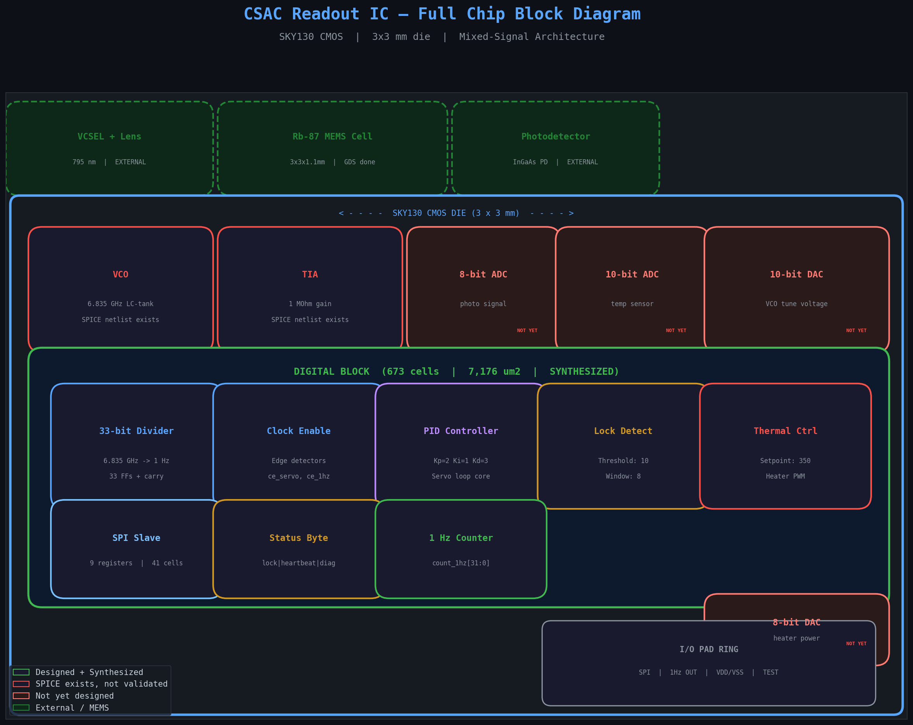
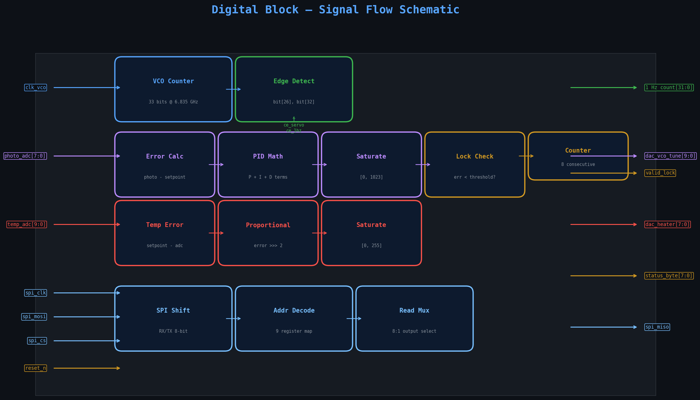
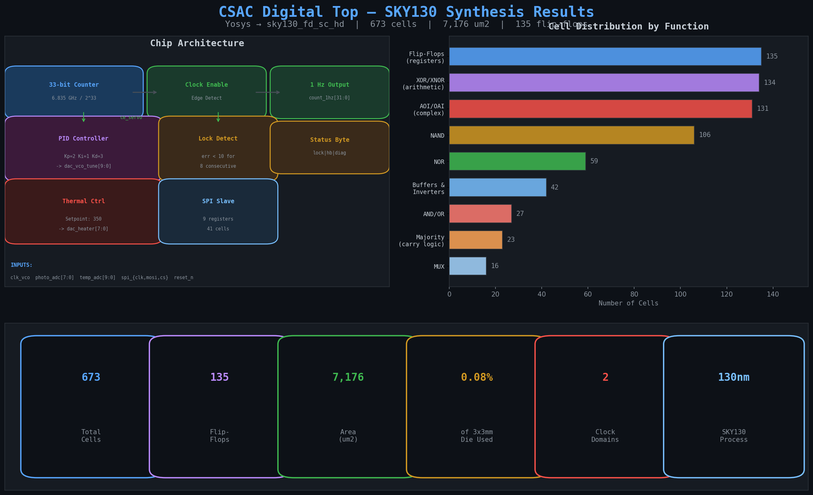
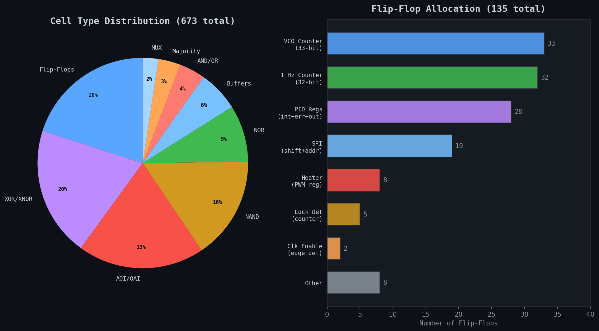
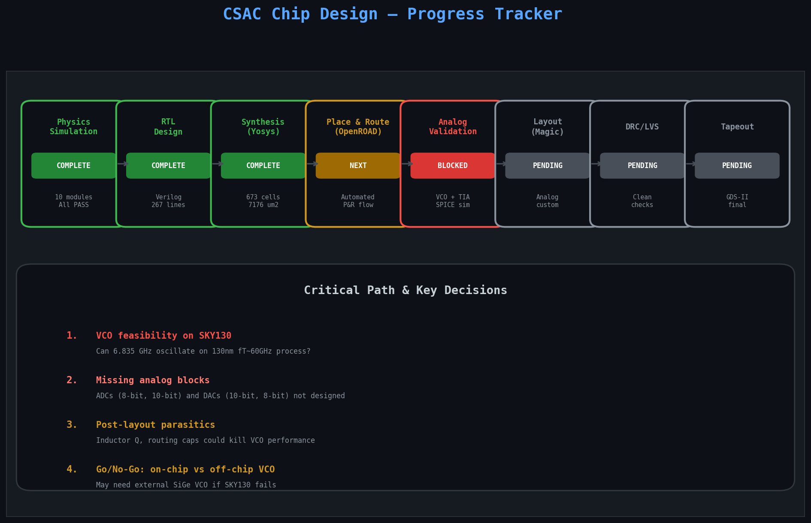

# Circuit Design — SKY130 CMOS Readout IC

## Overview

This folder contains the electronic circuit design for the CSAC (Chip-Scale Atomic Clock) readout IC. The design targets the **SKY130** 130 nm CMOS open-source process (SkyWater Foundries).

The IC integrates all electronics needed to lock a VCSEL laser to the Rb-87 hyperfine transition at 6,834,682,610.904 Hz and output a 1 Hz reference clock.



---

## Chip Architecture

The readout IC is a mixed-signal design on a 3x3 mm die with the following blocks:

### Analog (custom layout required)

| Block | Function | Status |
|-------|----------|--------|
| **VCO** | 6.835 GHz LC-tank oscillator, cross-coupled NMOS, varactor tuning | SPICE netlist exists |
| **TIA** | Transimpedance amplifier, 1 MOhm gain, photodiode readout | SPICE netlist exists |
| **10-bit DAC** | Drives VCO tuning voltage (0-1.8V) | Not yet designed |
| **8-bit DAC** | Drives heater PWM power | Not yet designed |
| **8-bit ADC** | Samples photodetector signal | Not yet designed |
| **10-bit ADC** | Samples temperature sensor | Not yet designed |

### Digital (synthesized, place & route ready)

| Block | Function | Cells | FFs |
|-------|----------|-------|-----|
| **33-bit Frequency Divider** | 6.835 GHz / 2^33 = ~1 Hz | ~100 | 33 |
| **PID Controller** | Servo loop: Kp=2, Ki=1, Kd=3 | ~200 | 28 |
| **Lock Detector** | Error < 10 for 8 consecutive samples | ~30 | 5 |
| **Thermal Controller** | Proportional heater control, setpoint=350 | ~40 | 8 |
| **SPI Slave** | 9-register MCU interface | 41 | 19 |
| **Clock Enable** | Edge detectors for ce_servo, ce_1hz | ~10 | 2 |
| **1 Hz Counter** | 32-bit output counter | ~80 | 32 |
| **Status Byte** | lock, heartbeat, diagnostics | wiring | 0 |
| **Total** | | **673** | **135** |

---

## Signal Flow

The digital block receives ADC samples, runs the PID servo, and outputs DAC control words. All sequential logic runs on a single clock domain (`clk_vco`) with clock-enable pulses for slower update rates.



### Port Map

**Inputs:**

| Port | Width | Description |
|------|-------|-------------|
| `clk_vco` | 1 | 6.835 GHz VCO clock |
| `photo_adc` | 8 | Photodetector ADC reading |
| `temp_adc` | 10 | Temperature sensor ADC reading |
| `spi_clk` | 1 | SPI clock from MCU |
| `spi_mosi` | 1 | SPI data in |
| `spi_cs` | 1 | SPI chip select (active low) |
| `reset_n` | 1 | Active-low async reset |
| `clk_slow` | 1 | ~1 MHz reference (unused in current design) |

**Outputs:**

| Port | Width | Description |
|------|-------|-------------|
| `dac_vco_tune` | 10 | VCO tuning voltage (PID output) |
| `dac_heater_power` | 8 | Heater PWM duty cycle |
| `count_1hz` | 32 | 1 Hz pulse counter |
| `valid_lock` | 1 | Servo loop locked indicator |
| `status_byte` | 8 | `{lock, 0, 0, heartbeat, integral[9:6]}` |
| `spi_miso` | 1 | SPI data out |

### SPI Register Map

| Address | Register | Access |
|---------|----------|--------|
| 0x00-0x03 | `count_1hz[31:0]` (4 bytes, MSB first) | Read |
| 0x04 | `status_byte` | Read |
| 0x05 | `dac_vco_tune[9:2]` | Read/Write |
| 0x06 | `dac_heater_power` | Read/Write |
| 0x07 | `photo_adc` | Read |
| 0x08 | `temp_adc[9:2]` | Read |

---

## Files

| File | Description |
|------|-------------|
| **RTL & Synthesis** | |
| `digital_top.v` | Verilog RTL — PID, divider, SPI, thermal (267 lines) |
| `synth.ys` | Yosys synthesis script targeting SKY130 |
| `digital_top_synth.v` | Gate-level netlist (673 SKY130 standard cells) |
| `digital_top_synth.json` | JSON netlist for OpenROAD place & route |
| **Analog SPICE** | |
| `vco_sky130.sp` | 6.835 GHz LC-tank VCO, cross-coupled NMOS pair |
| `tia_photodetector.sp` | Transimpedance amplifier + low-pass filter |
| **Visualization** | |
| `chip_block_diagram.png` | Full chip architecture with design status |
| `digital_signal_flow.png` | Digital block signal flow schematic |
| `digital_top_synth.png` | Synthesis results summary (cells, area, metrics) |
| `synth_cell_breakdown.png` | Cell type distribution and FF allocation |
| `design_progress.png` | Project progress tracker and critical path |
| `visualize_synth.py` | Script to regenerate synthesis plots |
| `gen_plots.py` | Script to regenerate architecture/progress plots |

---

## Synthesis Results

The digital block was synthesized using **Yosys 0.33** targeting the **sky130_fd_sc_hd** standard cell library (typical corner, 25C, 1.8V).



### Summary

| Metric | Value |
|--------|-------|
| Total cells | 673 |
| Flip-flops | 135 (134 dfrtp_1 + 1 dfstp_2) |
| Chip area | 7,176 um2 |
| % of 3x3mm die | 0.08% |
| Clock domains | 2 (clk_vco, spi_clk) |
| Unmapped cells | 0 (all mapped to SKY130) |
| Process | SKY130 130nm CMOS |
| Liberty file | sky130_fd_sc_hd__tt_025C_1v80.lib |

### Cell Breakdown



**Top cell types:**
- **135 Flip-Flops** (20%) — registers for counters, PID state, SPI shift
- **134 XOR/XNOR** (20%) — arithmetic in the 33-bit counter carry chain
- **131 AOI/OAI** (19%) — complex gates for PID math and saturation
- **106 NAND** (16%) — core logic
- **59 NOR** (9%) — core logic
- **23 Majority gates** — carry logic in the adder chains
- **16 MUX** — SPI read multiplexer

### RTL Fixes for Synthesis

The original RTL had three issues that prevented clean synthesis:

1. **Gated clocks** — `clk_100hz = vco_counter[26]` was used as a clock edge in `always @(posedge clk_100hz)`. This creates unmappable clock gating. Fixed by using a single `clk_vco` domain with clock-enable pulses (`ce_servo`, `ce_1hz`) generated by edge detectors.

2. **Async-load flip-flops** — The SPI slave used `posedge cs_n` as an async load signal, producing `$_ALDFF_PP_` cells that have no SKY130 equivalent. Fixed by using `negedge reset_n` for async reset and checking `cs_n` synchronously.

3. **Wire declarations inside always blocks** — Not valid synthesizable Verilog. Moved all combinational terms to module-level wires.

### How to Reproduce

```bash
cd 09_circuit_design
yosys -s synth.ys
```

Requires:
- Yosys >= 0.33
- SKY130 PDK installed (liberty file at `sky130A/libs.ref/sky130_fd_sc_hd/lib/sky130_fd_sc_hd__tt_025C_1v80.lib`)

---

## Frequency Divider

The VCO outputs 6.835 GHz. A 33-bit binary counter divides to ~1 Hz:

```
6,835,682,611 Hz  /  2^33  =  0.796 Hz
(trimmed by servo loop — exact frequency maintained by atomic lock)

Clock enable taps:
  vco_counter[26]  →  ce_servo   ~50 Hz   (PID update rate)
  vco_counter[32]  →  ce_1hz     ~1 Hz    (output counter)
```

---

## PID Servo Controller

The servo minimizes the error between the photodetector signal and a setpoint, adjusting the VCO tuning voltage to maintain atomic lock.

```
                    ┌──────────────────────┐
photo_adc[7:0] ──>  │  error = adc - 50    │
                    │                      │
                    │  P = error * 2       │
                    │  I += error >> 2     │  ──> dac_vco_tune[9:0]
                    │  D = (error-prev)*3  │
                    │                      │
                    │  out = P + I + D     │
                    │  saturate [0, 1023]  │
                    └──────────────────────┘
```

| Parameter | Value |
|-----------|-------|
| Setpoint | 50 (photodetector dark state) |
| Kp (proportional) | 2 |
| Ki (integral) | 1 |
| Kd (derivative) | 3 |
| Update rate | ~50 Hz (ce_servo) |
| Output range | 0-1023 (10-bit DAC) |
| Anti-windup | Integral clamped to [0, 1023] |
| Lock threshold | error < 10 for 8 consecutive updates |

---

## Analog Circuits

### VCO (`vco_sky130.sp`)

6.835 GHz LC-tank voltage-controlled oscillator.

| Parameter | Design Target |
|-----------|--------------|
| Center frequency | 6,834,682,611 Hz |
| Tuning range | +/- 500 MHz (varactor) |
| Phase noise | ~-90 dBc/Hz @ 1 MHz offset |
| Supply | 1.8V |
| Power | ~27 mW |
| Topology | Cross-coupled NMOS, on-chip inductor |

**Simulation:**
```bash
ngspice vco_sky130.sp
```

**Critical risk:** SKY130 has fT ~60 GHz. A 6.835 GHz oscillator is feasible but near the limit. Post-layout parasitics (especially inductor Q-factor) will determine if this works. May require off-chip SiGe VCO as fallback.

### TIA (`tia_photodetector.sp`)

Transimpedance amplifier for photodiode readout.

| Parameter | Design Target |
|-----------|--------------|
| Transimpedance | 1 MOhm (1 nA → 1 mV) |
| Bandwidth | ~100 kHz (-3dB) |
| Input noise | ~100 nV/sqrt(Hz) |
| LPF cutoff | 1.6 kHz |
| Supply | 1.8V |
| Power | ~3.6 mW |

**Simulation:**
```bash
ngspice tia_photodetector.sp
```

---

## Design Progress



### Completed

- [x] Physics simulation (10 modules, all PASS)
- [x] RTL design (digital_top.v, 267 lines)
- [x] Yosys synthesis (673 cells, all mapped to SKY130)
- [x] MEMS vapor cell GDS-II masks (csac_cell_v1.gds)
- [x] Design documentation (spec sheet, BOM, process traveler)

### Next Steps

- [ ] **VCO SPICE validation** — Run with real SKY130 transistor models (CRITICAL)
- [ ] **TIA SPICE validation** — Verify gain, bandwidth, noise
- [ ] **ADC/DAC design** — 8-bit and 10-bit converters (not yet started)
- [ ] **OpenROAD place & route** — Automated P&R for digital block
- [ ] **Analog layout in Magic** — Manual layout for VCO, TIA
- [ ] **Post-layout parasitic extraction** — ext2spice from Magic
- [ ] **DRC/LVS clean** — Zero errors required for tapeout
- [ ] **Final GDS-II merge** — Combine MEMS + CMOS layouts
- [ ] **Tapeout submission** — SKY130 MPW shuttle (~$12-30K)

### Critical Decisions

1. **VCO on-chip vs off-chip** — If SKY130 can't sustain 6.835 GHz oscillation with acceptable phase noise after layout parasitics, the VCO must move off-chip (SiGe BiCMOS or discrete GaAs). This changes the entire chip architecture.

2. **Missing analog blocks** — The ADCs and DACs that bridge between analog and digital domains are not designed. The digital block assumes `photo_adc[7:0]` and `temp_adc[9:0]` exist as inputs.

3. **Post-layout parasitics** — The on-chip inductor Q-factor and routing capacitance at 6.8 GHz are the biggest unknowns. EM simulation (ASITIC or FastHenry) of the inductor is required before committing to layout.

---

## Power Budget

| Block | Current | Voltage | Power |
|-------|---------|---------|-------|
| VCO (cross-coupled pair) | 10 mA | 1.8 V | 18 mW |
| VCO (biasing) | 5 mA | 1.8 V | 9 mW |
| TIA opamp | 2 mA | 1.8 V | 3.6 mW |
| Digital (counters, PID, SPI) | 5 mA | 1.8 V | 9 mW |
| Photodiode & sense | 1 mA | 1.8 V | 1.8 mW |
| DACs (10-bit) | 1 mA | 1.8 V | 1.8 mW |
| **Total IC** | **24 mA** | **1.8 V** | **~44 mW** |
| Heater (external) | -- | 3.3 V | ~50-80 mW |
| Laser driver (external) | -- | 3.3 V | ~30 mW |
| **Total system** | -- | -- | **~124 mW** |

Target: < 150 mW total system power. Current estimate: 124 mW (18% margin).

---

## SKY130 Design Constraints

| Parameter | Limit | Notes |
|-----------|-------|-------|
| Supply voltage | 1.8 V +/- 10% | Core voltage for all circuits |
| Gate length | >= 0.18 um | Minimum for SKY130 |
| Metal spacing | >= 0.14 um (M1), >= 0.28 um (M2) | DRC rules |
| Maximum current | ~100 mA/mm width | For power lines |
| Temperature range | -40 to 85 C | Process corners: ss, tt, ff, sf, fs |
| Oxide capacitance | ~8 fF/um2 | For varactor & MIM caps |
| Transistor fT | ~60 GHz | Limits VCO to ~7 GHz max |

---

## Tapeout Checklist

- [x] RTL design complete and synthesis-clean
- [x] Yosys synthesis — all cells mapped to SKY130
- [ ] SPICE simulations pass (transient, AC, monte carlo)
- [ ] OpenROAD place & route complete
- [ ] Layout DRC/LVS clean (Magic + open_pdks)
- [ ] Post-layout simulation matches schematic
- [ ] Static timing analysis passes (setup/hold)
- [ ] Power estimation < 150 mW
- [ ] ESD protection on all I/O pads
- [ ] Decoupling capacitors placed
- [ ] Substrate biasing strategy defined
- [ ] Test/probe points identified
- [ ] Submit to SKY130 MPW shuttle

---

## Tool Versions

| Tool | Version | Purpose |
|------|---------|---------|
| Yosys | 0.33 | RTL synthesis |
| SKY130 PDK | sky130A | Standard cells, transistor models |
| Liberty file | sky130_fd_sc_hd__tt_025C_1v80 | Timing/area for synthesis |
| Python | 3.12 | Visualization scripts |
| matplotlib | 3.10.8 | Plot generation |

## Regenerating Plots

```bash
cd 09_circuit_design
python3 visualize_synth.py    # Synthesis summary
python3 gen_plots.py          # Block diagram, signal flow, progress
```

---

## References

- SKY130 PDK: https://github.com/google/skywater-pdk
- Open_pdks: https://github.com/RTimothyEdwards/open_pdks
- Xschem: https://xschem.sourceforge.io/
- Magic: http://opencircuitdesign.com/magic/
- Yosys: https://yosyshq.net/yosys/
- OpenROAD: https://openroad.readthedocs.io/
- ngspice: https://ngspice.sourceforge.io/

---

**Created:** 2026-03-29
**Last updated:** 2026-04-04
**Status:** Digital synthesis complete. Analog validation pending.
