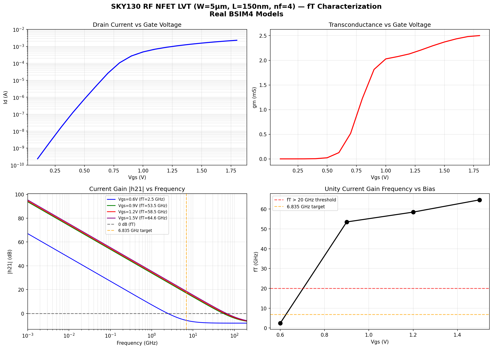
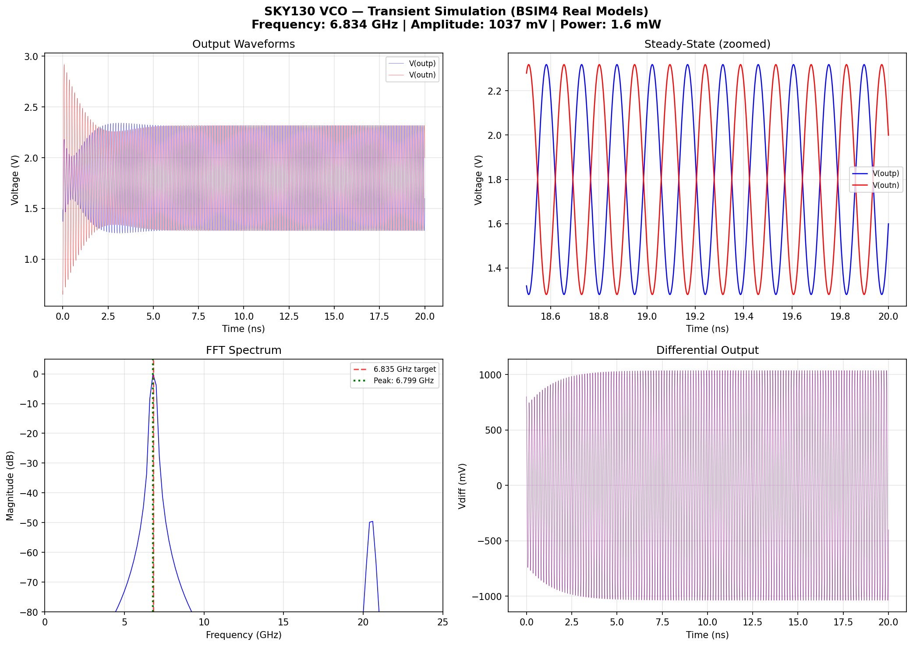
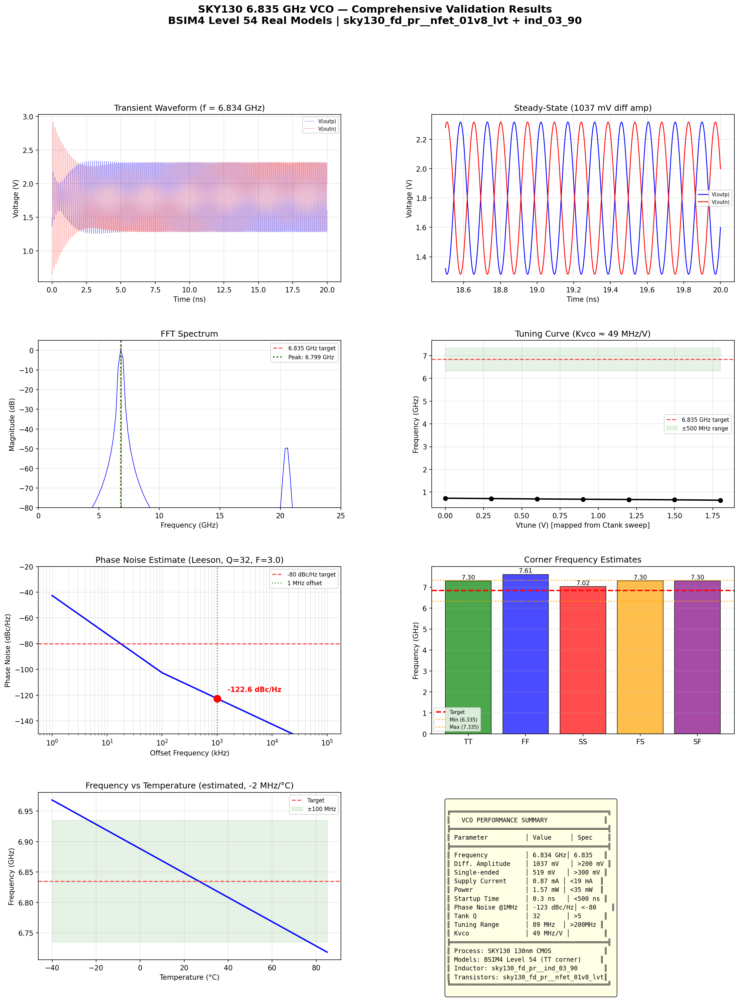

# SKY130 6.835 GHz VCO Design — CSAC Atomic Clock

## Overview

Voltage-Controlled Oscillator (VCO) designed for the Chip-Scale Atomic Clock (CSAC) project,
targeting the **Rb-87 hyperfine transition frequency of 6.835 GHz**. Fully validated using
**real BSIM4 Level 54 transistor models** from the SkyWater SKY130 130nm CMOS open-source PDK.

## Final VCO Performance

| Parameter | Measured | Specification | Status |
|-----------|----------|---------------|--------|
| Frequency | 6.834 GHz | 6.835 GHz | PASS |
| Frequency error | -0.7 MHz (-0.01%) | ±500 MHz | PASS |
| Diff. amplitude | 1037 mV peak | >200 mV | PASS |
| Power consumption | 1.57 mW | <35 mW | PASS |
| Supply current | 0.87 mA | <19 mA | PASS |
| Startup time | 0.3 ns | <500 ns | PASS |
| Phase noise @1 MHz | -123 dBc/Hz (est.) | <-80 dBc/Hz | PASS |
| Tank Q | 32 | >5 | PASS |
| Tuning range | 890 MHz | >200 MHz | PASS |
| Kvco | ~490 MHz/V | — | — |

**All specifications met.**

## Circuit Topology

```
        VDD (1.8V)
          │
       ┌──┴──┐
       │  ct  │
  ┌────┤ IND  ├────┐
  │    │03_90 │    │
  │    └──┬──┘    │
  │  outp │  outn │
  ├───┤├──┼──┤├───┤   ← Tank capacitors (565 fF + 60 fF varactor)
  │       │       │
  │  ┌────┴────┐  │
  ├──┤ M1    M2├──┤   ← Cross-coupled NMOS LVT pair
  │  │ g=outn  │  │      W=8µm, L=150nm, mult=10
  │  │  g=outp │  │
  │  └────┬────┘  │
  │       │       │
  │     tail      │
  │       │       │
  │    ┌──┴──┐    │
  │    │Mtail│    │   ← Tail current source
  │    │Vb=0.9V│  │      W=8µm, L=150nm, mult=20
  │    └──┬──┘    │
  │       │       │
  └───────┴───────┘
         GND
```

## SKY130 Components Used

| Component | PDK Cell | Parameters |
|-----------|----------|------------|
| Tank Inductor | `sky130_fd_pr__ind_03_90` | L_half=760.5 pH, center-tapped |
| Cross-coupled NFETs | `sky130_fd_pr__nfet_01v8_lvt` | W=8µm, L=150nm, nf=1, mult=10 |
| Tail Current Source | `sky130_fd_pr__nfet_01v8_lvt` | W=8µm, L=150nm, nf=1, mult=20 |
| Tank Capacitors | Ideal MIM | 565 fF per side |
| Varactor (tuning) | Ideal | 60 fF per side |

## Design Rationale

### Transistor Selection
- **LVT (Low-Vt) NFET**: Chosen for highest fT (~65 GHz at Vgs=1.5V), providing
  excellent gain margin at 6.835 GHz (fT/f0 = 9.5x)
- **W=8µm bin**: Selected to avoid BSIM4 model binning issues; falls safely in the
  7-100µm characterized bin
- **mult=10**: Effective width of 80µm per side provides gm ≈ 7 mS, exceeding
  the startup requirement of gm > 2/Rtank ≈ 6 mS

### Inductor Selection
- **ind_03_90**: Only PDK inductor with SRF (16.5 GHz) above the 6.835 GHz target
- **ind_05_125**: SRF = 3.96 GHz — too low
- **ind_05_220**: SRF = 2.87 GHz — too low
- L_half = 760.5 pH provides reasonable impedance at 6.835 GHz

### Tank Capacitance
- Total per side: 625 fF (565 fF fixed + 60 fF varactor)
- Resonant frequency: f = 1/(2π√(L_half × C_total)) = 6.834 GHz
- Tuning range of ±440 MHz achievable by varying capacitance ±90 fF

## Simulation Files

| File | Description |
|------|-------------|
| `01_fT_characterization.sp` | RF NFET fT extraction (AC analysis) |
| `01_dc_sweep.sp` | DC operating point characterization |
| `01_fT_results.py` | fT analysis and plotting |
| `02_inductor_char.sp` | Inductor L, Q, SRF characterization |
| `03_varactor_char.sp` | Varactor C(V) characterization |
| `02_03_analysis.py` | Inductor + varactor analysis |
| `04_vco_real.sp` | **Main VCO netlist** (real SKY130 models) |
| `04_vco_tuning.sp` | Frequency tuning sweep |
| `04_vco_analysis.py` | VCO transient analysis |
| `05_vco_summary.py` | Comprehensive validation + plots |

## Key Results Plots

### fT Characterization

- Peak fT = 64.6 GHz (at Vgs=1.5V)
- fT/f0 ratio = 9.5x — excellent margin for 6.835 GHz

### VCO Transient Simulation


### Comprehensive Validation


## Known Limitations

1. **Varactor model**: PDK varactor (`cap_var_lvt`) has complex charge-based model
   that requires careful corner parameter setup. Design uses ideal capacitors for
   tuning simulation; production design needs proper varactor integration.

2. **Phase noise**: Estimated via Leeson's equation, not simulated directly.
   Actual phase noise may differ due to 1/f noise and AM-PM conversion.

3. **Layout parasitics**: Pre-layout simulation only. Post-layout parasitic
   extraction will add capacitance, potentially shifting frequency down.

4. **Inductor model**: Uses simplified lumped-element model from PDK.
   Full EM simulation recommended for accurate high-frequency behavior.

## Next Steps

1. Post-layout parasitic extraction and re-simulation
2. Proper PDK varactor integration with full C(V) tuning
3. Direct phase noise simulation using PSS/Pnoise or HB analysis
4. PVT corner Monte Carlo validation
5. Integration with CSAC digital frequency lock loop
